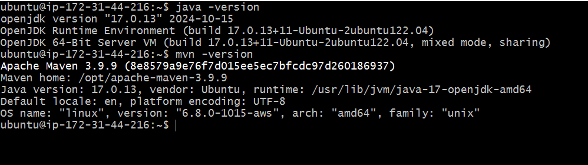
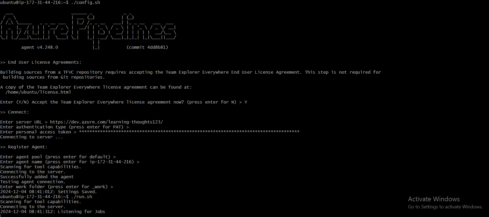
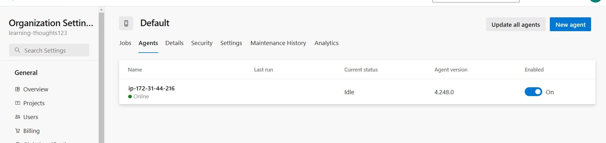

# Linux Self Hosted Agent #

- You can install the agent on Linux, macOS, or Windows machines. You can also install an agent on a Docker container.
- Here we are using linux self Hosted Agent
  - for [linux](https://learn.microsoft.com/en-us/azure/devops/pipelines/agents/linux-agent?view=azure-devops)

## Step 1 : Create an linux  instance on any Cloud
  - SSH Into the instance and Download necessary Softwares Required to run the application
  - For Running `Spring-pet-clinic`
      1. Openjdk-17
      2. Maven 
  - Install Above Softwares as Follows
    1. Java
    ```
    sudo apt update
    sudo apt install openjdk-17-jdk -y
    ```
    2. Maven
    ```bash
    sudo wget https://dlcdn.apache.org/maven/maven-3/3.9.9/binaries/apache-maven-3.9.9-bin.tar.gz
    ```
 

## Step 2: Configure Agent
   1. Navigate to Azure-devops-Organization>>Project>>Project setting>>Agent Pools>>Default>>Add New Agent
   2. Select an New Agent as Linux agent and Configure it on Your ec2 Instance.

   3. Now Navigate to Agent Pools>>Default>>
     Youll see your agent status `online`.



      
     
   


  